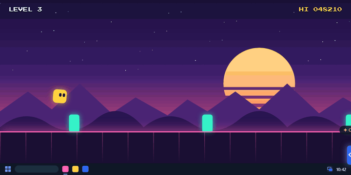
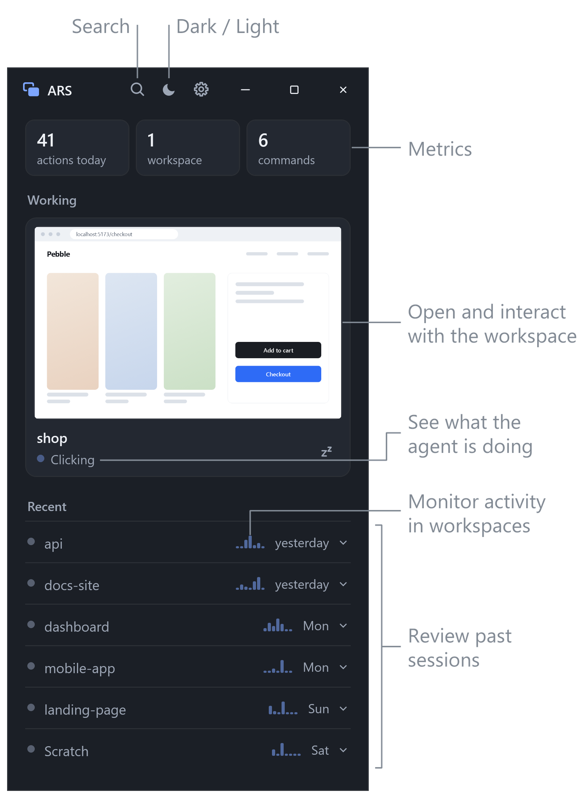
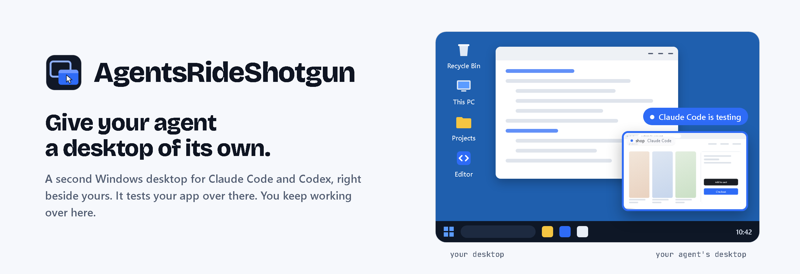

<h1 align="center">AgentsRideShotgun (ARS)</h1>

<table>
<tr>
<th width="50%">Without ARS</th>
<th width="50%">With ARS</th>
</tr>
<tr>
<td></td>
<td></td>
</tr>
</table>

<p align="center"><b>Stop letting agents take the wheel. Give them a desktop of their own and let them ride shotgun.</b> Agents can still perform full computer use while their ARS workspace stays out of your way. Token efficient, all local, and automatic.</p>

---

<p align="center"></p>

<table>
<tr>
<td width="58%" valign="top">

### Install options

1. **Installer**

   [Download **ARS-Setup.exe**](https://github.com/JeffLepp/AgentsRideShotgun/releases/latest/download/ARS-Setup.exe) and run it.

2. **WinGet** (pending Microsoft review)

   ```powershell
   winget install AgentsRideShotgun
   ```

3. **Build from source**

   Requires the .NET 10 SDK on Windows 10 (build 19041) or later.

   ```powershell
   git clone https://github.com/JeffLepp/AgentsRideShotgun
   cd AgentsRideShotgun
   dotnet build app/ARS.csproj -c Release
   ```

</td>
<td width="42%" valign="top">

### First run

1. Open ARS and press **Start** to connect your detected agents.
2. Use Claude Code or Codex as usual. On first use, you may need to ask for ARS by name: **“Use ARS to test this.”**

### Windows compatibility

The Windows package targets x64 Windows 10 build 19041 or later and x64 Windows 11. It bundles .NET 10. Browser work needs an installed Edge or Chrome, and desktop work needs a signed-in interactive Windows session.

</td>
</tr>
</table>

<p align="center">Anyone can use, modify, and share ARS under the <a href="LICENSE">MIT License</a>.</p>

<p align="center">
  <picture>
    <source media="(prefers-color-scheme: dark)" srcset=".github/readme/banner-dark.png">
    
  </picture>
</p>
