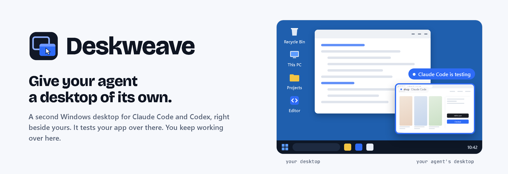
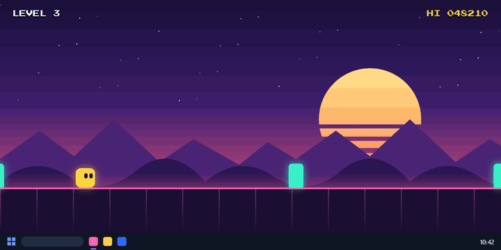
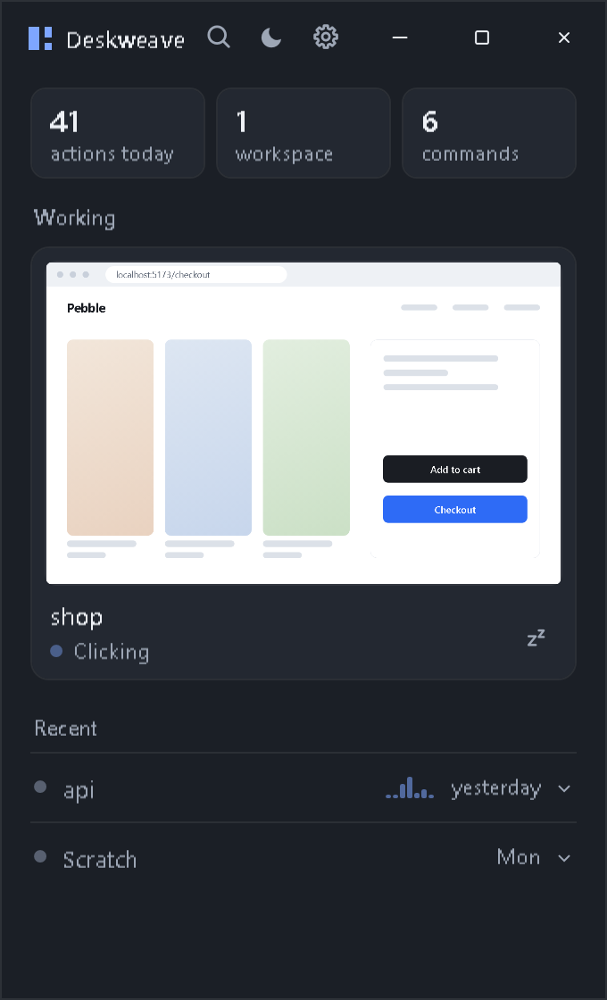
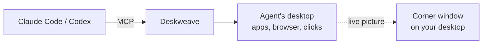

<p align="center">
  <picture>
    <source media="(prefers-color-scheme: dark)" srcset="assets/banner-dark.png">
    
  </picture>
</p>

<p align="center">
  <a href="https://github.com/JeffLepp/Deskweave/releases/latest"></a>
  
  
  <a href="LICENSE"></a>
</p>

<p align="center">
  <a href="https://github.com/JeffLepp/Deskweave/releases/latest"><b>Download for Windows</b></a>
  &nbsp;·&nbsp; <a href="#how-it-works">How it works</a>
  &nbsp;·&nbsp; <a href="#faq">FAQ</a>
</p>

<br>

<table>
<tr>
<th width="50%">Without Deskweave</th>
<th width="50%">With Deskweave</th>
</tr>
<tr>
<td></td>
<td></td>
</tr>
<tr>
<td align="center"><sub>Its windows land on top and take your mouse. You pause and wait.</sub></td>
<td align="center"><sub>It works in the corner. You keep playing.</sub></td>
</tr>
</table>

<table>
<tr>
<th width="50%">Without Deskweave</th>
<th width="50%">With Deskweave</th>
</tr>
<tr>
<td></td>
<td></td>
</tr>
</table>

<p align="center"><i>"Co-work, without the co-mouse."</i></p>

<br>

**Deskweave gives your agent a desktop of its own.** A real second Windows desktop, running quietly
beside yours, where it opens apps, clicks and tests while you keep working. No VM. No Docker. No
second copy of Windows. One download, and Claude Code and Codex connect in a click.

## What you get

<table>
<tr>
<td width="50%" valign="top">

</td>
<td width="50%" valign="top">

**A desktop per project.** Every project your agent works in gets its own workspace the first
time it needs one. Everything else shares one called Scratch.

**A window in the corner.** When an agent starts working, a small live picture of its desktop
fades in at the edge of your screen, then gets out of the way.

**Take over anytime.** Click the corner window to drive the agent's desktop yourself. The agent
waits, and carries on when you leave.

**See what it did.** Every action is logged with a screenshot, so "it works on my machine" comes
with receipts.

**Pause everything.** One shortcut (<kbd>Ctrl</kbd>+<kbd>Alt</kbd>+<kbd>P</kbd>) stops every agent.

**Cleans up after itself.** Idle desktops go to sleep after 30 minutes and wake when an agent
needs them.

</td>
</tr>
</table>

## Install

1. [Download **Deskweave-Setup.exe**](https://github.com/JeffLepp/Deskweave/releases/latest). It installs just for you, with no admin rights needed.
2. Open Deskweave. It finds Claude Code and Codex on your PC. Press **Start** to connect them.
3. Ask your agent to test something. That's it.

Agent sessions that were already open may need a restart to see Deskweave.

## How it works

Windows can run more than one desktop at a time. Deskweave creates one for your agent and gives
the agent tools to use it, over [MCP](https://modelcontextprotocol.io): `run`, `open` and
`browse` start things there, `look` sees the screen, and `computer` clicks and types.



Programs the agent starts through Deskweave run on the agent's desktop. Programs it starts some
other way, like its own terminal, still run on yours, just as they would without Deskweave.
Deskweave teaches connected agents to prefer its tools when a window is involved.

## FAQ

**Is it a sandbox?**
No. The agent's desktop is on the same PC, with the same files, apps and permissions as you. It
keeps the agent's windows, clicks and keystrokes off your screen. It does not keep the agent
out of anything it could already reach.

**Does it need an account or an API key?**
No. Your agents keep using their own sign-in. Deskweave doesn't see your credentials.

**What happens when a site needs me to sign in?**
The agent hands it to you. You sign in yourself, and the agent carries on with that session.

**Which agents work?**
Claude Code and Codex connect automatically. Any other agent that speaks MCP can connect with
the setup text in Settings.

**Why Windows only?**
That's where agents fight you for the mouse today. Other systems may come later.

## Build from source

Requires the .NET 10 SDK on Windows 10 (build 19041) or later.

```powershell
git clone https://github.com/JeffLepp/Deskweave
cd Deskweave
dotnet build app/Deskweave.csproj -c Release
```

## License

[MIT](LICENSE). Made by [Jefferson Kline](https://github.com/JeffLepp).
